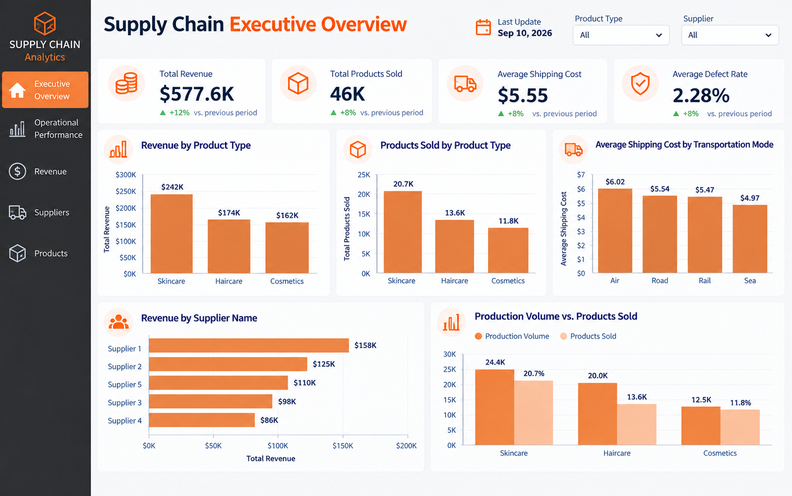
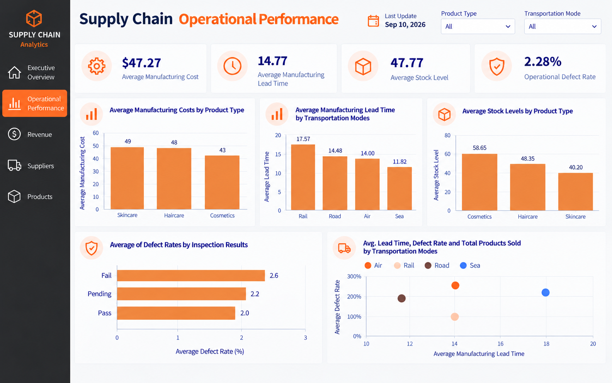
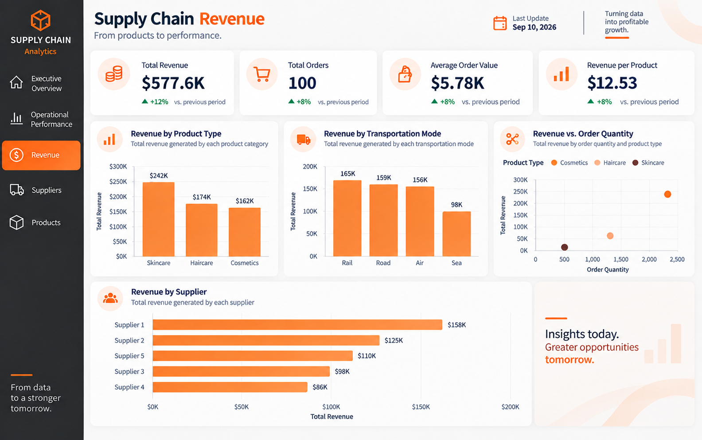
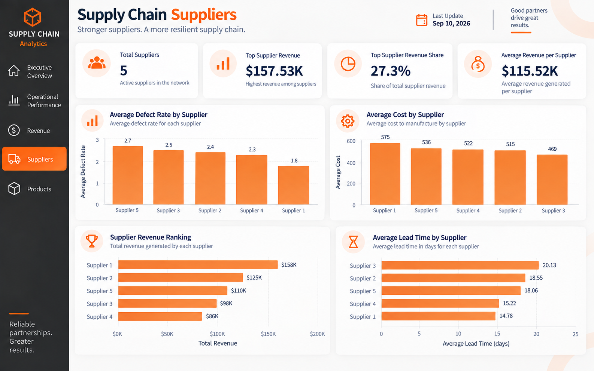
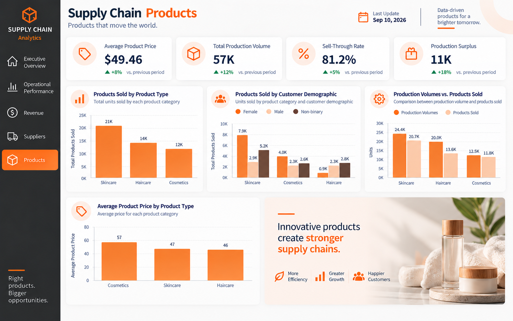

# Supply Chain Performance Dashboard

Data analytics project focused on analyzing supply chain performance, operational efficiency, revenue, suppliers, and product performance using PostgreSQL, SQL and Power BI.

## Project Objective

The objective of this project is to analyze supply chain data and transform raw operational information into actionable business insights.

The analysis focuses on:

- Revenue performance
- Operational efficiency
- Supplier performance
- Product performance
- Manufacturing costs
- Lead times
- Inventory levels
- Defect rates
- Production and sales performance

## Technologies

- PostgreSQL
- SQL
- DBeaver
- Power BI
- DAX
- Power Query
- GitHub

## Data Preparation & SQL

The data was stored and analyzed in PostgreSQL, using DBeaver as the database management environment.

SQL was used to:

- Create and structure the database table
- Define constraints and data integrity rules
- Clean and standardize the dataset
- Perform exploratory and analytical queries
- Calculate key business metrics
- Prepare the data for visualization in Power BI

The complete SQL queries used in the project are available in the [`sql/queries.sql`](sql/queries.sql) file.

## Power BI Dashboard

The dashboard was developed in Power BI and organized into five analytical pages:

1. **Executive Overview** — provides a high-level view of revenue, products sold, shipping costs, defect rates, product categories, and supplier performance.
2. **Operational Performance** — analyzes manufacturing costs, manufacturing lead time, stock levels, defect rates, and transportation performance.
3. **Revenue** — evaluates revenue by product type, transportation mode, and supplier, as well as the relationship between revenue and order quantity.
4. **Suppliers** — compares suppliers based on revenue, defect rates, costs, and lead times.
5. **Products** — analyzes product sales, customer demographics, production volume, sell-through rate, production surplus, and product prices.

## Key Insights

The analysis highlighted several relevant patterns across the supply chain:

- Supplier performance varies in terms of revenue, costs, lead time, and defect rates.
- Differences in manufacturing lead time and defect rates can be observed across transportation modes.
- Product categories present different levels of revenue, sales, production volume, and pricing.
- The comparison between production volume and products sold reveals production surpluses across product categories.
- Customer demographics show differences in product purchasing patterns.
- Revenue performance varies across suppliers, product categories, and transportation modes.

## Dashboard Preview

### Executive Overview



### Operational Performance



### Revenue



### Suppliers



### Products


## Project Structure

```text
supply-chain-performance-dashboard/
│
├── data/
│   └── supply_chain_data.csv
│
├── images/
│   └── Dashboard screenshots
│
├── powerbi/
│
├── sql/
│   └── queries.sql
│
├── LICENSE
└── README.md
